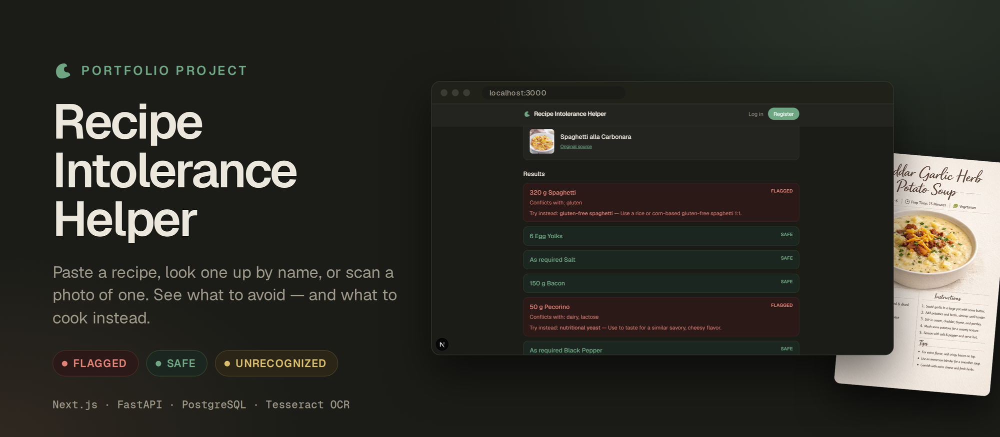
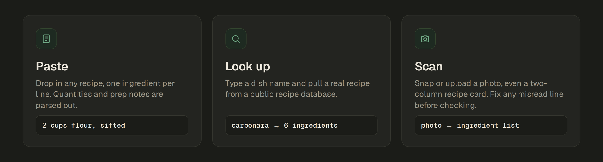
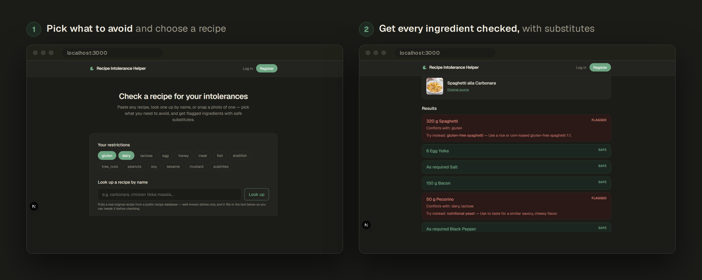
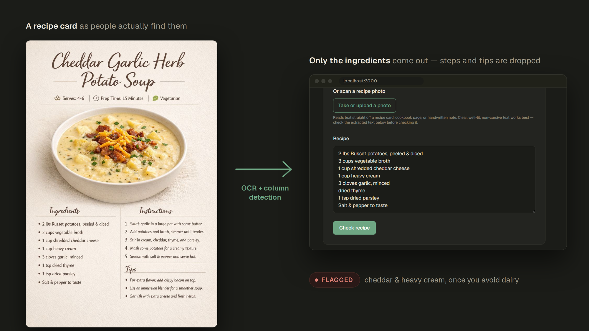
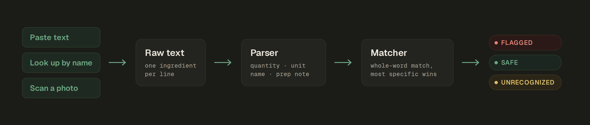
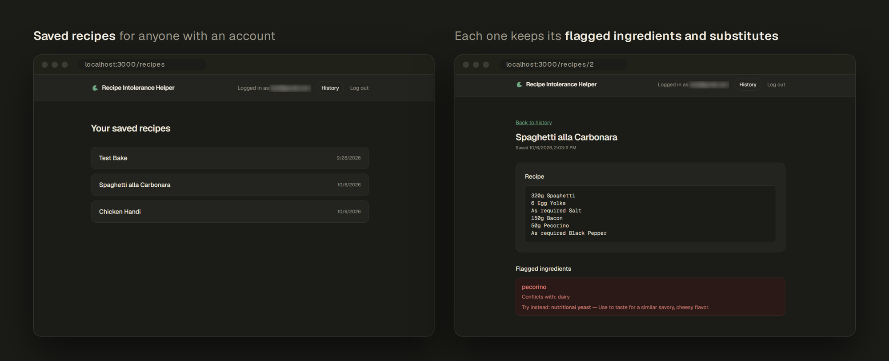
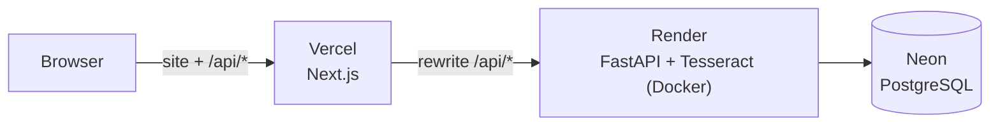

<p align="center">
  
</p>

<p align="center">
  <a href="https://recipe-intolerance-helper.vercel.app/"></a>
</p>

<p align="center">
  <a href="https://github.com/liviakiss/recipe-intolerance-helper/actions/workflows/ci.yml"></a>
  
  
  
  
  
  
  
</p>

<p align="center">
  <b>Paste it. Look it up. Snap a photo.</b><br>
  Every ingredient checked against what you can't eat, with a substitute for each one that conflicts.
</p>

<p align="center">
  <a href="https://recipe-intolerance-helper.vercel.app/"><b>Try it live &rarr;</b></a>
</p>

---

## Try it in 30 seconds

Open the [live demo](https://recipe-intolerance-helper.vercel.app/), pick **gluten** and **dairy**, and paste this:

```text
2 eggs
200 g plain flour
100 g butter
1 cup dairy-free milk
1 jar mystery relish
```

You get the flour flagged for gluten and the butter for dairy, each with a substitute. The dairy-free milk comes back safe, and the relish comes back **unrecognized** rather than guessed at. You can also look up a dish by name (try *carbonara*) or upload a photo of a recipe card.

> The demo runs on free hosting that sleeps when idle, so the very first load can take up to a minute. The page tells you while it waits.

## Three ways in



All three end up in the same place: a list of ingredients, each marked **flagged**, **safe** or **unrecognized**.

## What you get



Pick from 14 restrictions (gluten, dairy, lactose, egg, honey, meat, fish, shellfish, tree nuts, peanuts, soy, sesame, mustard, sulphites). Anything that conflicts is flagged with the reason and a substitute that solves *that specific* restriction, so cheddar flagged for dairy suggests a dairy-free cheddar, not just "something else".

## Scanning real recipe cards



People don't have clean ingredient lists. They have Pinterest cards, screenshots and cookbook photos, with two columns, decorative fonts and steps next to the ingredients. Plain OCR reads straight across those layouts and mixes everything together.

So the scanner works from where the words actually sit:

- finds the column split from word positions, then keeps only the column that looks like an ingredient list
- drops steps, tips, "Serves / Prep time" lines and stray bullet characters
- straightens phone photos (EXIF rotation) and upscales small images before reading
- puts the result in an **editable** text box, so a misread line is a quick fix instead of a dead end

## One pipeline behind all three



Because everything becomes plain text first, there is one parser and one matcher instead of three separate checkers.

## Accounts and history



The checker works fully anonymously. An account is only needed to save recipes, and it also syncs your restrictions across visits.

---

## Design decisions

**Three outcomes, not two.** An ingredient the database doesn't know is *not* the same as one that is safe. Reporting "unrecognized" separately means the app never claims something is safe when it simply doesn't know, which matters for a tool people may use around allergies.

**Whole-word matching, most specific wins.** Real recipes say "Free-range Eggs" and "Boneless Chicken Thighs", not "egg" and "chicken". Each known ingredient is matched as a whole-word phrase anywhere inside the parsed name, and the longest match wins, so "olive oil" beats any shorter accidental overlap. It is simple, explainable and fast, with one honest limit: coverage is as large as the ingredient dictionary (over 600 seeded entries).

**Look-alikes are handled in the data, and "free-from" words in the matcher.** Longest-match has a trap: "cream of tartar" contains "cream", and "almond flour" contains "flour". Those get their own entries so they aren't flagged for dairy or gluten, and a test checks the tricky phrases. Words like *gluten-free*, *dairy-free* and *vegan* in front of an ingredient cancel the tags they cover, so "gluten-free pasta" isn't flagged for gluten, and the app never flags its own suggested substitutes (a test checks that too). *Lactose-free milk* only cancels lactose: it is still dairy.

**Restrictions are data, not code.** Ingredients map to restriction tags, and substitutes are keyed by *ingredient + tag*. Supporting a new ingredient or diet means adding rows, not changing logic.

**Photo scanning is built to be swapped.** `extract_text_from_image` takes image bytes and returns text, and nothing else depends on how that happens. Today it runs local OCR (free, and no image leaves the server). The same function could call a vision-capable AI model later without touching the rest of the app.

**Upload hardening.** The scan endpoint checks the declared file type, caps uploads at 8 MB, and treats the actual decode as the real validation, since a client-declared content type can't be trusted. Failures return clear 4xx errors, not crashes.

**Auth.** Argon2 password hashing, and a JWT in an HttpOnly, SameSite cookie, so the token is never readable from JavaScript. In production the cookie is also marked Secure.

**Rate limits.** Photo scans are the one expensive endpoint, so they are limited per visitor and across all visitors together. Login, registration and recipe lookup are limited too, and a limited request gets a `429` with a `Retry-After` header. The counters live in memory, which is enough for a single small server.

**Photos are never stored.** A scanned image is read in memory and thrown away; only the extracted text comes back. The browser also shrinks large phone photos before uploading them.

## Tech stack

| Layer | Tools |
|---|---|
| Frontend | Next.js (App Router), React 19, TypeScript, Tailwind CSS v4 |
| Backend | FastAPI, SQLAlchemy, Alembic, Pydantic |
| Database | PostgreSQL ([Neon](https://neon.com) in production) |
| Photo scanning | Tesseract OCR (pytesseract), Pillow |
| Recipe lookup | [TheMealDB](https://www.themealdb.com/api.php) public API |
| Hosting | Vercel (frontend), Render (backend in Docker, with Tesseract), Neon (database). All free tiers |
| Tests | 150+ pytest tests, run on every push by GitHub Actions: parser, matcher, dictionary, upload validation, rate limits, and the real OCR on generated images |

## How it's hosted



The browser only ever talks to the Vercel domain. Vercel forwards `/api/...` to the backend, so the login cookie stays on one domain and isn't treated as a blocked third-party cookie. Migrations run automatically each time the backend container starts.

<details>
<summary><b>Deploy your own copy</b></summary>

1. **Database:** create a Neon project and copy the connection string (direct, not pooled; it ends in `?sslmode=require`). From `backend`, with `DATABASE_URL` set in your terminal, run `alembic upgrade head` and `python seed.py`.
2. **Backend:** create a Render Web Service from the repo with **Language: Docker**, **Root Directory: `backend`**, health check path `/`.
3. **Frontend:** import the repo into Vercel with **Root Directory: `frontend`**. Set the variables *before* the first deploy, because `NEXT_PUBLIC_` values are baked in at build time.
4. Point `CORS_ORIGINS` on Render at your Vercel address.

| Where | Variable | Value |
|---|---|---|
| Render | `DATABASE_URL` | the Neon connection string |
| Render | `SECRET_KEY` | a long random string |
| Render | `COOKIE_SECURE` | `true` |
| Render | `CORS_ORIGINS` | `https://your-app.vercel.app` |
| Vercel | `NEXT_PUBLIC_API_URL` | `/api` |
| Vercel | `BACKEND_URL` | `https://your-service.onrender.com` |

The backend refuses to start without `DATABASE_URL` or `SECRET_KEY`. To avoid cold starts, ping the backend's `/` every 10 minutes with a free cron service.

</details>

## Run it locally

**Prerequisites:** Node.js 20+, Python 3.11+, PostgreSQL, and [Tesseract OCR](https://github.com/UB-Mannheim/tesseract/wiki) (on Windows the installer's default location is found automatically; on macOS or Linux install it with your package manager).

<details>
<summary><b>Backend</b></summary>

```bash
cd backend
python -m venv venv
# Windows: .\venv\Scripts\Activate.ps1      macOS/Linux: source venv/bin/activate
pip install -r requirements.txt
cp .env.example .env          # then fill in DATABASE_URL and SECRET_KEY
alembic upgrade head          # create the tables
python seed.py                # load restriction tags, ingredients and substitutes
uvicorn app.main:app --reload
```

The API runs on http://localhost:8000.

</details>

<details>
<summary><b>Frontend</b></summary>

```bash
cd frontend
npm install
cp .env.example .env.local
npm run dev
```

Open http://localhost:3000.

</details>

<details>
<summary><b>Tests</b></summary>

```bash
cd backend
pytest
```

The tests use a temporary in-memory database, so they never touch your real one. The scanner tests need Tesseract and are skipped if it isn't installed.

</details>

## Known limitations

- **Coverage is dictionary-bound.** Ingredients missing from the database show as "unrecognized". That is deliberate (see above), and it includes products whose contents depend on the brand, such as hoisin sauce or margarine. Coverage only grows as the dictionary does.
- **OCR quality varies.** Clean cards and screenshots work well. Blurry, angled or heavily decorated photos can drop or garble lines, which is why the text can be corrected before checking.
- **A helper, not medical advice.** It reads ingredient names only. Hidden allergens, cross-contamination and "may contain" warnings are outside its scope.

## What's next

- A paid always-on host, so there is no cold start
- Frontend tests, and lint and build checks in CI
- Vision-model scanning as an optional upgrade behind a setting, with login-only access and a rate limit
- A larger ingredient dictionary and per-ingredient confidence
- One-click diet presets in the UI (Vegan, Vegetarian, Gluten-free). The preset data is already modelled and seeded in the backend
